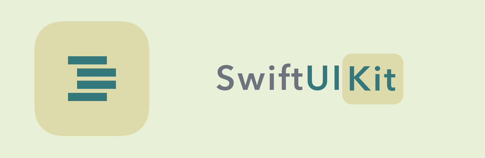
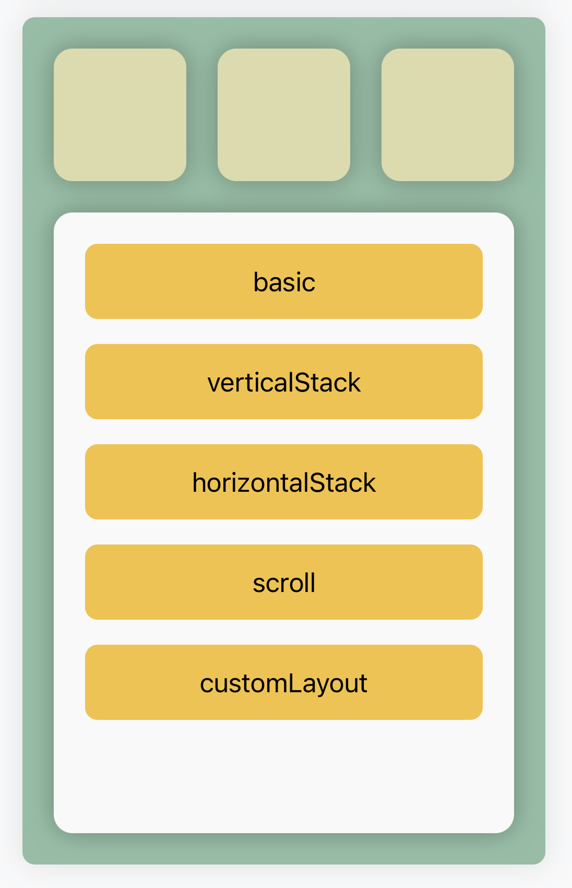

<br/>

[](#Required)
[](#Development%20Progress)
[](https://github.com/sonla58/SwiftUIKit/issues)
[](https://github.com/sonla58/SwiftUIKit/network/members?style=for-the-badge)


# SwiftUIKit

**SwiftUIKit** combines the element of *UIKit* with declarative style from *SwiftUI*. Take a look to see how it magically



```swift
ZStackView {
    ZStackView {
        VStackView(spacing: 20, distribution: .fill) {
            HStackView(spacing: 20) {
                ForEach([0,1,2]) { _, _ in
                    UIView()
                        .dx.backgroundColor(ThemeManager.shared.current.box2)
                        .dx.style(UI.ViewStyle.Card2())
                        .constrainingAspectRatio(ratio: 1)
                }
            }
            ZStackView {
                VStackView(spacing: 16, distribution: .fill) {
                    ForEach(Item.allCases) { (index, item) in
                        ZStackView {
                            UILabel()
                                .dx.text(String(describing: item))
                                .centeringInParent()
                        }
                        .dx.backgroundColor(ThemeManager.shared.current.box3)
                        .dx.style(UI.ViewStyle.CornerRadius(radius: 8))
                        .dx.startAddGesture
                        .action { [weak self] in
                            self?.present(BasicVC(), animated: true, completion: nil)
                        }
                        .commitGesture()
                        .sizing(width: nil, height: 48)
                    }
                    UIView()
                }
                .fillingParent(insets: 20)
            }
            .dx.backgroundColor(ThemeManager.shared.current.background2)
            .dx.style(UI.ViewStyle.Card2())
        }
        .fillingParent(insets: 20)
    }
    .dx.backgroundColor(ThemeManager.shared.current.box1)
    .dx.style(UI.ViewStyle.Card1())
    .fillingParent()
}
```

<br/>

# Special Thanks Layoutless team

This project was strongly inspired by [Layoutless](https://github.com/DeclarativeHub/Layoutless). Most of the ideas and implementation in the core system layout were reused from Layoutless. I just made some changed for rename, made a new API style for the layout system and it enables `DeclarativeExtension`.

# Features
- [x] Build layout without interface builder with fancy declarative style.
- [x] Support layout with stack view: `VStackView`, `HStackView` and `ZStackView`.
- [x] Support `ScrollView`.
- [x] Use directly UIKit element.
- [x] Enable *declarative* way to construct and modify property of UI element.
- [x] Support styling.
- [x] Support traitQuerySet.

# Requirement

- iOS 11+
- XCode 12+
- Swift 5.3+

# Installation

## CocoaPods

Add following line to your project's Podfile
```ruby
pod 'SwiftUIKit_pro', '1.0.rc1'
```
Run `pod install` to install SwiftUIKit

## Source Code

Drop all files in folder `./SwiftUIKit` to your project or download this repo and drag `SwiftUIKit.xcodeproj` to your project with necessary files then link your app with `SwiftUIKit` framework munualy

# Usage

## Content

1. [Basic layout](#Basic%20Layout)
2. [DeclarativeExtension](#DeclarativeExtension)
3. [Base Views](#Base%20Views)
4. [Styling](#Styling)
5. [Advance](#Advance)

## Basic Layout

Updating...

## DeclarativeExtension

Updating...

## Base Views

Updating...

## Styling

Updating...

## Advance

Updating...

